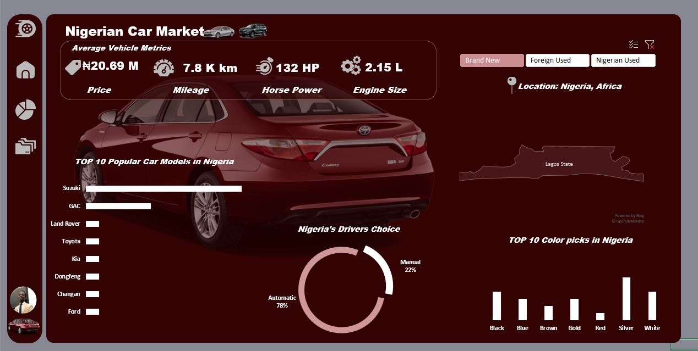

🚘 Nigerian Car Market Analysis Dashboard (Excel  Project)

Overview

This project is a comprehensive and interactive Business Intelligence (BI) dashboard analyzing the Nigerian Car Market, segmented by vehicle condition: Brand New, Foreign Used, and Nigerian Used.

The entire dashboard, including data cleaning, transformation, and visualization, was built using Microsoft Excel and its powerful Power Query feature, demonstrating advanced proficiency in these widely-used corporate tools.

Goal

To provide strategic, data-driven insights into market trends, pricing dynamics, buyer preferences, and model popularity within the Nigerian automotive sector.

Final Dashboard Visualizations
**Dashboard Visual:**

The dashboard provides a consistent view across four main states, accessible via interactive filters (not shown here, but implemented in the Excel file):
View	Screenshot	Key Insight Highlighted
Overall Market Metrics		The starting point, showing blended average metrics (e.g., Avg. Price ₦4.99 M) and overall brand popularity.
Brand New Segment		Price is highest (Avg. ₦20.69 M) but average HP is lowest (132 HP), with Suzuki and GAC leading the popularity.
Foreign Used Segment		Highest average HP (248 HP) despite being mid-range in price (Avg. ₦8.91 M), with Toyota and Mercedes-Benz as top brands.
Nigerian Used Segment		The most affordable segment (Avg. ₦4.01 M), with Toyota dominating popularity and a high preference for Automatic transmission (94%).

Technical Implementation

Tools Used

    Data Cleaning & Transformation: Power Query (M Language within Excel)

    Visualization & Reporting: Microsoft Excel (Charts, Tables, Conditional Formatting)

    Data Source: (Specify your data source here, e.g., Scraped automotive listings)

Power Query Data Cleaning and Transformation Steps

The integrity of the dashboard relies on the following meticulous pre-processing steps executed in Power Query:

    State Column Normalization:

        The raw geographical column was split and cleaned to isolate and standardize the state names, enabling accurate geographical mapping.

    Mileage Standardization:

        Mileage values were cleaned to reflect realistic mileage and consistently formatted to the KPI unit "K km".

    Transmission Type Consolidation:

        The Transmission column contained variants like AMT and CVT. Based on technical research, these were correctly classified and consolidated into the primary category Automatic transmission.

        The final segmentation is simplified to Automatic vs. Manual, accurately representing "Nigeria's Drivers Choice."

    KPI Formatting:

        All Key Performance Indicators (KPIs) were strictly formatted for immediate readability, including: Price (₦ Million), Engine Size (L), Horse Power (HP), and Mileage (K km).

    Data Exploration:

        Pivot Charts and Tables were utilized for initial exploration and validation, confirming the accuracy of all averages and trends before final visualization.

Key Market Insights

    Performance vs. Cost: The Foreign Used segment offers significantly higher average Horse Power (248 HP) for less than half the price of a Brand New vehicle (₦20.69 M).

    Reliability Preference: Toyota is the unchallenged market leader in the used segments, underscoring the high value placed on longevity and resale value.

    Automatic Dominance: The market exhibits a near-universal preference for Automatic transmission (e.g., 95% in Foreign Used), a crucial factor for urban transportation.
